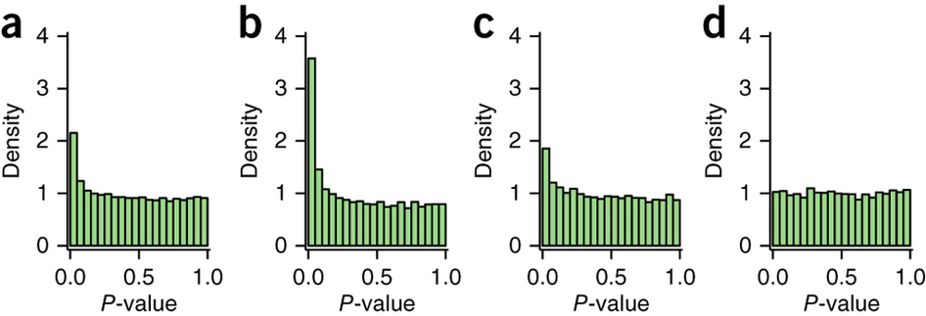

layout: false
class: middle center

```{r packages,include=FALSE}

library(here)
library(ggsci)
library(magrittr)
library(tidyverse)
library(kableExtra)

library(DESeq2)
library(IHW)

theme_set(
  theme_bw()+
    theme(
      strip.text = element_text(size = 16),
      strip.background = element_blank(),
      axis.text = element_text(size = 14),
      legend.text = element_text(size =14),
      axis.title = element_text(size = 16),
      legend.title = element_text(size = 16)
      
    )
)


```


```{r paper_fig,out.width=600,echo=FALSE}

knitr::include_graphics("paper_figs/paper.png",dpi = 1200)

```

---
layout: false
class: top center

.font4[.alert[Multiple hypothesis testing]]

.font2.black[

.content[

.alert[Hypothesis testing:] $H_0: \theta \in \Theta_0$ vs. $H_1: \theta \in \Theta_1$. 

.alert[Multiple hypothesis testing:] $H_{0i}$ vs. $H_{1i}$ for $i=1,\cdots,m$.

.alert[Solution:] For each test, we get a p.value $p_1,\cdots, p_m$, and then use 

.alert[p.adjust(pvalues,method = "BH")],

.alert[qvalue(pvalues)]  (equivalent to BH with some assumptions)

and call it a day

]
]


---
layout: false
class: top center

.font4[.alert[False discovery Rate]]

.font3.black[

.center[

.content[

| | Not significant  | Significant | total | 
| :------------: | :----------: | :--------: | 
||    (p.value > t) |  (p.value <= t) |  |
|  Null true     |   U | V | m0 |
| Alternative true | T | S | m1 |
| total | W | R| m | 
]

want to control .alert[FDR = E[V/R | R > 0]P(R > 0)]

]]

---
layout: false
class: top center

.font4[.alert[False discovery Rate]]

.font3.black[

The general idea is to define for threshold t:
]

.font2[
\begin{aligned}
V(t) &= \# (\text{true null } p_i \leq t) \\
R(t) &= \# (p_i \leq t ) \\
\end{aligned}
]

.font2[
\begin{aligned}
\widehat{\mbox{FDR}}(t) &= \hat{\pi}_0 (\lambda) mt / (R(t)\wedge 1)
\end{aligned}
]
.font3[Can be done with the [qvalue package](http://bioconductor.org/packages/release/bioc/html/qvalue.html)]

---
layout: false
class: center middle

.font4[.alert[IHW idea]]

```{r fig1,out.width=1000,echo=FALSE}



```

.font2.black[

.left[

.content[

.alert[a)] Typical multiple testing diagnostic plot for all p.values, .alert[b-c)] p.values from .alert[(a)] divided into 3 strata. For a good partition, there are going to be more discoveries in .alert[(b-c)] than in .alert[(a)].

]
]]

---
layout: false
class: center middle

.font4[.alert[IHW idea]]

.font2.left[.alert[1.] Given pairs of p.values and covariates] 

.font1[
\begin{aligned}
(p_i,x_i),\quad i=1,\cdots,m
\end{aligned}
]

.font2.left[generate a partition of the pairs into G groups.]

.font2.left[.alert[2.] Given a partition of the m tests, into G groups, replace:]

.font1[
\begin{aligned}
\widehat{\mbox{FDR}}(t) &= \hat{\pi}_0 (\lambda) mt / (R(t)\wedge 1)
\end{aligned}
]

.font1[
\begin{aligned}
\widehat{\mbox{FDR}}(t,w ) &= \sum_{g=1}^G m_g w_g t_g / (R(t,w)\wedge 1)
\end{aligned}
]

.font2.left[The idea is estimate the weights that give the highest number of discoveries, the partition is based on a covariate independent to the p.values.]

---
layout: false
class: left middle

.split-two[

.column[
.content[

.font3.center[.alert[IHW idea]]

.center[
```{r tdr,include=TRUE,echo=FALSE,out.width=450}

knitr::include_graphics("paper_figs/fig3tdr.png",dpi = 1200)

```

.font1[
\begin{aligned}
f(p) &= \pi_0 f_0(p) + \pi_1 f_1(p) \\
\mbox{tdr}(p) &= \frac{\pi_1 f_1(p)}{f(p)}
\end{aligned}

]

]
]]

.column[
.content[

.font2[

.alert[a)] Schematic representation of the density f, .alert[b–d)] The .alert[tdr] of individual tests can vary.

.alert[b)] The test has high power, and π0,i is well below 1

.alert[c)] The test has equal power, but π0,i is higher, leading to a reduced .alert[tdr]

.alert[d)] π0,i is as in .alert[b)], but the test has little power, again leading to a reduced .alert[tdr]
]

]]]


---
layout: false
class: center middle

.split-two[

.column[
.content[
.font3[.alert[IHW idea]]

```{r fig3,include=TRUE,echo=FALSE,out.width=450}

knitr::include_graphics("paper_figs/fig3boundary.png",dpi = 1200)

```

.font2.left[

.alert[e)] If an informative covariate is associated with each test, the distribution of the P-values from multiple tests is different for different values of the covariate. 
]


]]

.column[.content[
.font2.left[

.red[BH] accounts only for the P-values and not the covariates
In contrast, the decision boundary of .blue[IHW] is a step function: each step corresponds to one weight


.alert[f)] The .alert[tdr's density] also depends on the covariate. The decision boundary of .red[BH] leads to a suboptimal set of discoveries. In contrast, .blue[IHW] approximates a line of constant .alert[tdr], i.e. the .alert[FDR budget's] use is  more efficient

]]]
]

---
layout: false
class: left top

.font4.center[.alert[Gene expression example]]

.font2[Typical .alert[DESeq2] workflow, on a gene expression dataset]

```{r data_load,include=FALSE,echo=FALSE,eval=TRUE}

data("airway", package = "airway")

```

.font2[The .alert[airway] dataset has `r nrow(airway) %>% prettyNum(big.mark = ",")` genes, and `r ncol(airway)` samples (4 cells x 2 treatments)]

```{r deseq_call,include=TRUE,echo = TRUE,message=FALSE,cache=TRUE}

library("DESeq2")
library("dplyr")
data("airway", package = "airway")
dds <- DESeqDataSet(se = airway, design = ~ cell + dex) 
dds <- DESeq(dds)
deRes <- as.data.frame(results(dds))

```

.font2[Formula based approach to use .alert[IHW]]

```{r ihw_call,include=TRUE,echo=TRUE,message=FALSE,cache=TRUE,dependson="deseq_call"}

library("IHW")
ihwRes <- ihw(pvalue ~ baseMean,  data = deRes, alpha = 0.1)

```

---
layout: false
class: left top

.font4.center[.alert[Quick comparison]]

.font2[Using a significance threshold of α = 0.1, we can notice]

```{r checkup,include=TRUE,echo=TRUE,eval=TRUE,cache=TRUE,dependson="ihw_call"}

rejections(ihwRes)

padjBH <- p.adjust(deRes$pvalue, method = "BH")
sum(padjBH <= 0.1, na.rm = TRUE)

```

.font2[.alert[We get more rejections, i.e. more discoveries!]]

---
layout: false
class: left middle 

.split-two[

.column[.content[

.center.top[.font3.alert[Diagnostics]]

```{r strata-code,eval=FALSE,echo=TRUE,include=TRUE}
plot(ihwRes)
```


```{r stratum,echo=FALSE,include=TRUE,eval=FALSE}
plot(ihwRes)+
  theme(
    legend.position = c(.1,.6)
  )+scale_color_npg()
```

.font2[.alert[G = 22] strata and do .alert[5-fold CV]]

```{r boundarycode,include=TRUE,echo=TRUE,eval=FALSE}
plot(ihwRes,what = "decisionboundary")
```


```{r boundary,echo=FALSE,eval=TRUE,include=TRUE,fig.width=7.5,fig.height=5,out.width=400, dpi = 1200}

plot(ihwRes,what = "decisionboundary")+scale_color_npg()+
  scale_fill_viridis_c()

```


]]

.column[.content[

.middle[
```{r stratum-out,echo=FALSE,include=TRUE,eval=TRUE,ref.label="stratum",fig.width=7.5,fig.height=4.5,out.width=500,dpi = 1200}
```
]

.font2[

The weights are driven by the total number of reads, for strata with low reads the weights are .alert[nearly zero]

]


]]]


---
layout: false
class: top left

.font4.center[.alert[Bad covariate selection]]

```{r bad_cov,include=TRUE,echo=FALSE,eval=TRUE,fig.width=10,fig.height=3,out.width=900,dpi = 1200,warning=FALSE}
deRes <- na.omit(deRes)
deRes$geneid <- as.numeric(gsub("ENSG[+]*", "", rownames(deRes)))

# set up data frame for ggplotting
rbind(data.frame(pvalue = deRes$pvalue, covariate = rank(deRes$baseMean)/nrow(deRes), 
                 covariate_type="base mean"),
      data.frame(pvalue = deRes$pvalue, covariate = rank(deRes$geneid)/nrow(deRes), 
                 covariate_type="gene id")) %>%
ggplot(aes(x = covariate, y = -log10(pvalue))) + geom_hex(bins = 51) + 
   facet_grid( . ~ covariate_type) + ylab(expression(-log[10]~p))+
  scale_fill_viridis_c()+
  scale_y_continuous(limits = c(0,20))
```

.font2[

.alert[in the left panel] mean expression is correlated with the p.values, while
.alert[in the right panel] the gene id's are not 

]

---
layout: false
class: top left

.split-two[

.column[.content[

.font3.center[.alert[Good covariate: avg expression]]

.center[
.content[

```{r deseq_hist,include=TRUE,echo=FALSE,eval=TRUE,dpi=1200,fig.width=5,fig.height=3,out.width=350}

ggplot(deRes, aes(x = pvalue)) +
  geom_histogram(binwidth = 0.025, boundary = 0,fill="white",colour = "black")

```

```{r ihw_ecdf,include=TRUE,echo=FALSE,eval=TRUE,dpi=1200,fig.width=5,fig.height=3,out.width=350}

deRes$baseMeanGroup <- groups_by_filter(deRes$baseMean, 8)
ggplot(deRes, aes(x = pvalue, col = baseMeanGroup)) + stat_ecdf(geom = "step") +
  labs(colour = "base mean\ngroup")+
  scale_color_npg()+
  labs(y = "F(pvalue)")

```

.font2[The groups on the .alert[right] looks like the histogram on the .alert[left]]

]]


]]

.column[.content[


```{r ihw_hist,include=TRUE,echo=FALSE,eval=TRUE,dpi=1200,fig.width=5,fig.height=10,out.width=330}

ggplot(deRes, aes(x = pvalue)) +
  geom_histogram(binwidth = 0.025, boundary = 0,fill="white",colour = "black")+
  facet_wrap( ~ baseMeanGroup, nrow = 4)

```


]]]


---
layout: false
class: top left

.split-two[

.column[.content[

.font3.center[.alert[Bad covariate: fold change]]

.center[
.content[

```{r deseq_hist2,include=TRUE,echo=FALSE,eval=TRUE,dpi=1200,fig.width=5,fig.height=3,out.width=350}

ggplot(deRes, aes(x = pvalue)) +
  geom_histogram(binwidth = 0.025, boundary = 0,fill="white",colour = "black")

```

```{r ihw_ecdf2,include=TRUE,echo=FALSE,eval=TRUE,dpi=1200,fig.width=5,fig.height=3,out.width=350}

deRes$baseMeanGroup <- groups_by_filter(abs(deRes$log2FoldChange),8)
ggplot(deRes, aes(x = pvalue, col = baseMeanGroup)) + stat_ecdf(geom = "step") +
  labs(colour = "fc group")+
  scale_color_npg()+
  labs(y = "F(pvalue)")

```

.font2[All groups look .alert[different]]

]]


]]

.column[.content[


```{r ihw_hist2,include=TRUE,echo=FALSE,eval=TRUE,dpi=1200,fig.width=5,fig.height=10,out.width=330}

ggplot(deRes, aes(x = pvalue)) +
  geom_histogram(binwidth = 0.025, boundary = 0,fill="white",colour = "black")+
  facet_wrap( ~ baseMeanGroup, nrow = 4)

```


]]]


---
layout: false
class: middle center

.font5[.alert[Why this paper?]]

.font3.black[

This is a very general method to do .alert[multiple hypothesis testing]

Can dramatically improve the number of discoveries, while controlling the .alert[false discovery rate]

]


---
layout: false
class: middle left

.split-two[

.column[.content[

.font3.center[.alert[Many data types]]

.center[
.content[


```{r manydata1,out.width=400,include=TRUE,echo=FALSE,eval=TRUE}
knitr::include_graphics("paper_figs/fig2a.png",dpi = 1200)

```


.font2.left[
.alert[a)] RNA-seq data with mean of normalized counts for each gene as the covariate

.alert[b)] Hyperplexed mass-spectrometry data with number of peptides quantified per protein as the covariate 
]


]]


]]

.column[.content[


```{r manydata2,out.width=400,include=TRUE,echo=FALSE,eval=TRUE}
knitr::include_graphics("paper_figs/fig2b.png",dpi = 1200)

```

.font2.left[

.alert[c)] histone QTL (hQTL) data set16 for chromosome 21, with genomic distance between SNPs and ChIP-seq signals as the covariate. Independent filtering with different distance cutoffs was also applied. 
.alert[d)] Weight function learned by IHW at α = 0.1 for the hQTL data set


]


]]]


---
layout: false
class: center middle

.font4[.alert[Covariate ideas]]

```{r covariates,include=TRUE,echo=FALSE,out.height=800,message=FALSE}

"extra/covariates.txt" %>% 
  read_tsv() %>% 
  knitr::kable() %>% 
  kable_styling(bootstrap_options = c("striped", "hover"),font_size = 32)


```


---
layout: false
class: middle center bg-main1

.font5[.alert[Extra slides]]

---
layout: false
class: middle center

.font4[.alert[[qvalue](http://bioconductor.org/packages/release/bioc/html/qvalue.html) is equivalent to BH]]

```{r qvalue,include=TRUE,out.width=530,echo= FALSE}

knitr::include_graphics("paper_figs/qvalue.png",dpi = 1200)

```

---
layout: false
class: middle center bg-main1

.font5[.alert[Links]]

.font2.left[

- [Data-driven hypothesis weighting increases detection power in genome-scale multiple testing](https://www.nature.com/articles/nmeth.3885)

- [Bioconductor IHW package](http://bioconductor.org/packages/release/bioc/html/IHW.html), [vignette](http://bioconductor.org/packages/release/bioc/vignettes/IHW/inst/doc/introduction_to_ihw.html)

- [Bioconductor qvalue package](http://bioconductor.org/packages/release/bioc/html/qvalue.html), [vignette](http://bioconductor.org/packages/release/bioc/vignettes/qvalue/inst/doc/qvalue.pdf)


]

